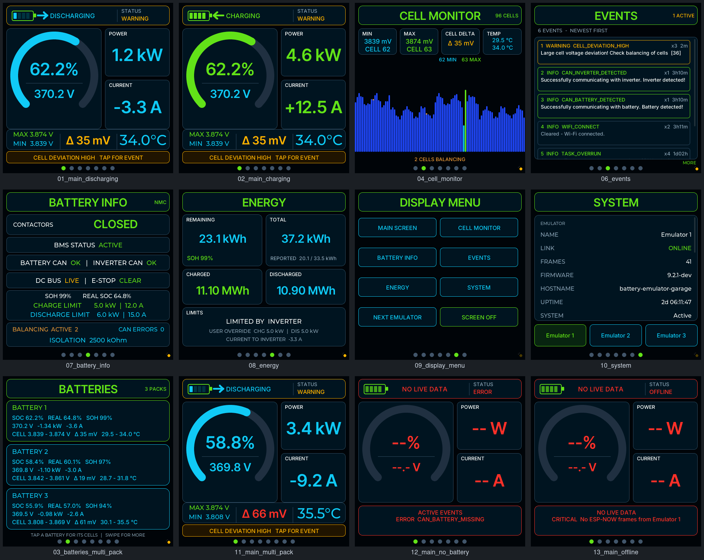

# Battery-Emulator ESP-NOW display for the Guition 4848S040 (ESPHome + LVGL)

`be-monitor.yaml` is an ESPHome configuration for the Guition ESP32-S3 4848S040
(480×480 ST7701S panel, GT911 touch). It receives [Battery-Emulator](https://github.com/dalathegreat/Battery-Emulator)
telemetry directly over ESP-NOW (protocol v2, no router hop, read-only) and shows
it in the look of
[sort282-rgb/battery-display-esp32-4848s040c](https://github.com/sort282-rgb/battery-display-esp32-4848s040c)
(v15.9, 480×480 UI), rebuilt with the ESPHome LVGL component.

## Setup

1. ESPHome **2026.9.0 or newer** (validated with 2026.9.0 / LVGL 9.5.0).
2. `secrets.yaml`: `wifi_ssid_hif`, `wifi_password_hif`, `ota_password`,
   `encryption_key`, `vnc_password`.
3. Put the name and STA MAC of each emulator in the `emulator_N_name` /
   `emulator_N_mac` substitutions.
4. On the emulator, enable ESP-NOW. Either leave "ESPNow receiver MACs" empty
   (broadcast), or list this display's MAC. The display has to be on the same
   Wi-Fi channel, which in practice means the same access point.
5. Fonts (Inter, Inter Tight) come from Google Fonts at build time, so the first
   compile needs internet access.

## Pages

Swipe left or right; the pages wrap around. You can also tap a page dot.

| Page | Content |
|---|---|
| MAIN | Status header with an animated battery, flow arrow, direction and emulator status. SOC arc with pack voltage, power, current, cell max/min, Δ and max temperature. Tap MAX or MIN to jump to that cell. An amber bar (red for errors) links to an active event. |
| BATTERIES | One card per pack. Only in the rotation when the emulator reports more than one pack. Tap a card to open its cells. |
| CELL MONITOR | All cells of the selected pack. Lowest and highest cells are marked, and balancing cells have amber caps. Tap or drag across the bars to read single cells; tap the title for the next pack. |
| EVENTS | The emulator's 10 newest events with severity, state, count, age and message. |
| BATTERY INFO | Contactors, BMS, battery/inverter CAN, DC bus, E-stop, SOH, charge/discharge limits, balancing, CAN errors and isolation for the selected pack. |
| ENERGY | Remaining, total and reported energy, lifetime charged/discharged, limiting factor and user overrides. |
| DISPLAY MENU | Shortcuts to every page, next emulator, screen off. |
| SYSTEM | Emulator and network diagnostics, plus the emulator selector. |

With one pack, MAIN and ENERGY show pack 1. With several packs they show the
AGGREGATE frame (the installation as the inverter sees it), and the per-pack pages
follow the selected pack.

## Changes from `be-monitor_nmhh_6.yaml`

The hardware, network, ESP-NOW peers, emulator selection, idle/VNC wake-up and the
TLV walk are kept. The tabview UI is replaced, and a few things are fixed:

- **Event severity order.** Upstream `EVENTS_LEVEL_TYPE` is INFO, DEBUG, WARNING,
  UPDATE, ERROR. The old config had 3 and 4 swapped, so errors were shown as
  updates and updates as errors.
- **Event payload.** Key `0xA5` is retired upstream. `0xAA` (int16) is read now,
  and `0xA5` is only used as a fallback for older emulators. The readable event
  message (`0xA7`) is shown too.
- **Multi-pack.** The AGGREGATE frame (type 5) is decoded for installation-wide
  values.
- **Online flag.** The flag and watchdog are now raised inside the decoder, so only
  frames that pass the emulator filter count. Previously the follow-up actions also
  fired for frames from emulators that were not selected.
- **VNC source.** `vnc` now comes from `nagyrobi/esphome-components` `main`. The
  `feat/zlib-compression` branch no longer exists; `compression` is on `main`.
- **Cell chart.** The chart is drawn by one widget's draw event instead of one
  widget per cell.

## How it was checked

- `esphome config` passes on ESPHome 2026.9.0, and C++ code generation for the
  ESP32-S3 target succeeds.
- The UI was also built for ESPHome's `host` platform with an SDL display: the same
  LVGL YAML and lambdas, compiled against LVGL 9.5.0 with no warnings. A simulated
  emulator fed it real v2 TLV frames, and touch input was driven through the
  window. The screenshots come from that build.
- **Not yet run on the physical panel.**

## Credits

- Design: sort282-rgb, battery-display-esp32-4848s040c (GPL-3.0).
- Fonts: Inter and Inter Tight (SIL OFL).
